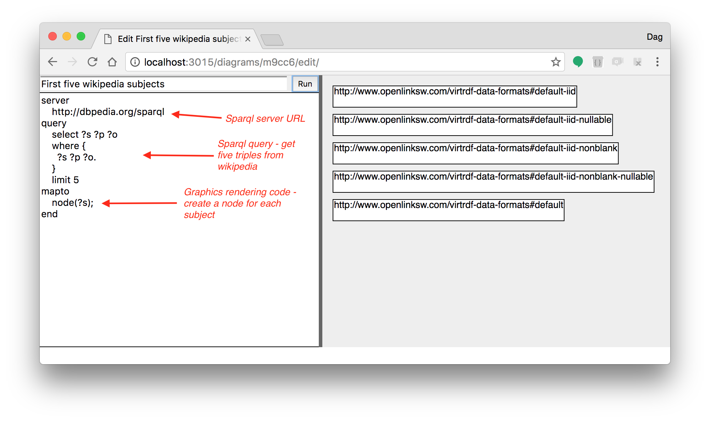
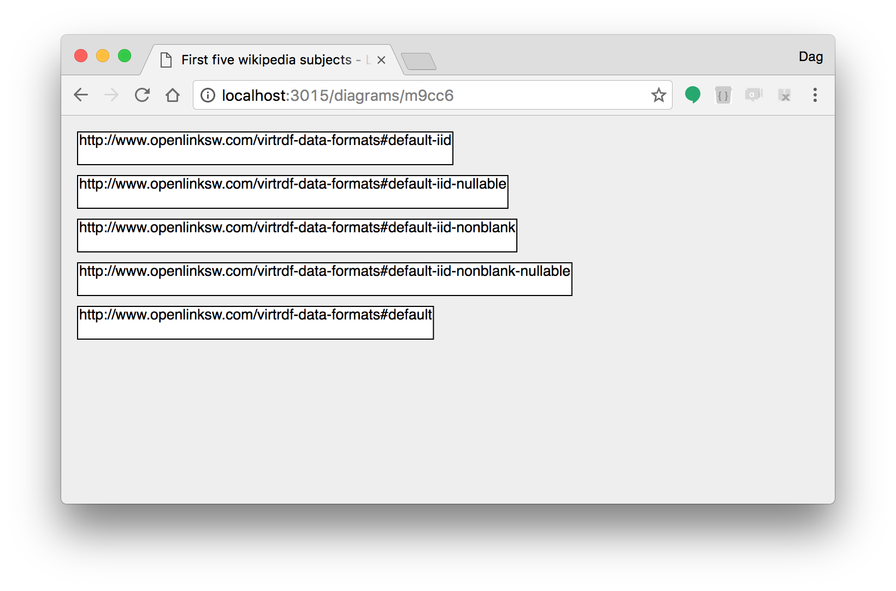
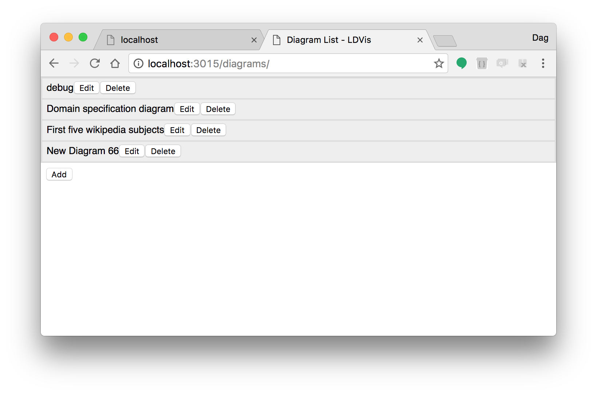
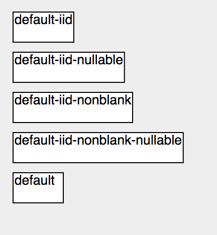
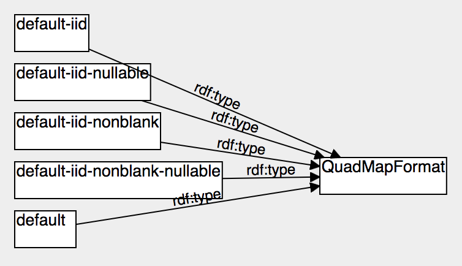
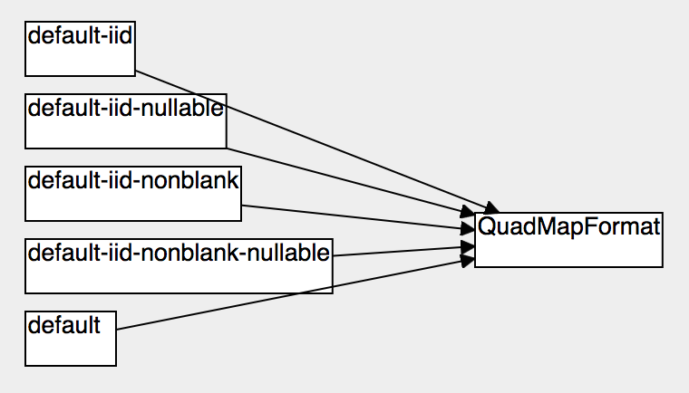
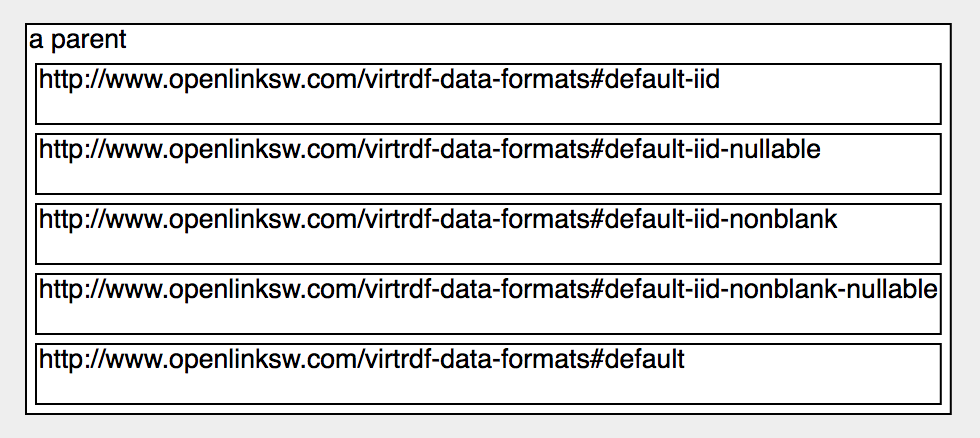
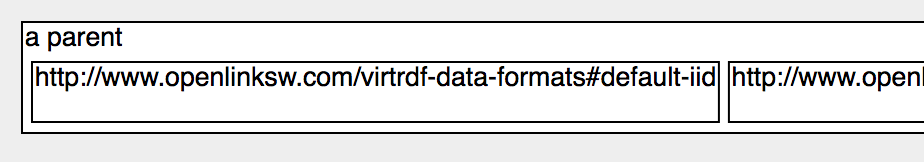
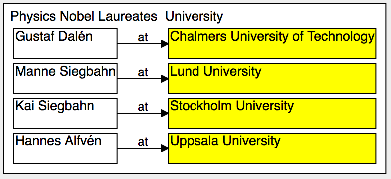

# LDVis - Linked Data Visualizer

<!-- START doctoc generated TOC please keep comment here to allow auto update -->
<!-- DON'T EDIT THIS SECTION, INSTEAD RE-RUN doctoc TO UPDATE -->


- [The mapping specification](#the-mapping-specification)
  - [server](#server)
  - [query](#query)
  - [mapto](#mapto)
    - [Nodes](#nodes)
    - [Lines](#lines)
    - [Nested nodes](#nested-nodes)
    - [Layout](#layout)
- [Set up development environment](#set-up-development-environment)
  - [Prerequisites](#prerequisites)
  - [Checkout, build and run](#checkout-build-and-run)

<!-- END doctoc generated TOC please keep comment here to allow auto update -->

*New! See a demo of LDVis and how to create the Larger Example below on https://youtu.be/O2nZBS_8xM4.*

LDVis is a web app that visualizes objects and relations from a triple store based on a mapping specification.



Click Run to render a diagram according to the specification.

When you are satisfied with the specification, you can view just the diagram - always based on fresh data from the database.



You can get a list of all diagrams.



Currently any user can create, remove and run any diagram.

LDVis runs on a server that stores the diagrams with their mapping specification and title. LDVis runs in the browser. The server interactions occur only:
- when you starts LDVis, to deliver the web application to your browser
- when you run or edit a diagram, to deliver the specification to the web app
- when you edit the mapping specification, the web app regularily sends the changed specification to be saved in the server
- when you run the diagram, the web app sends a request for data to the LDVis server that forwards the request to the triple server that returns the result to the LDVis server that send it back to the web application that renders the diagram

## The mapping specification

The mapping specification tells, for example:

- URL to server to run the query
- the SPARQL query getting the data to visualize
- which object types to display as graphical nodes of a certain shape, color etc
- which relations to display as lines between the nodes
- which relations to define node hierarchy - how nodes nest inside each others
- which values to display as text labels inside the nodes

The app then uses the mapping specification to navigate the triple store and display the nodes and lines.

### server

The server should support the SPARQL 1.1 Graph Store HTTP Protocol (see https://www.w3.org/TR/sparql11-http-rdf-update/).

The example URL above - http://dbpedia.org/sparql - goes to the triple store serving the contents of wikipedia.

### query

This should be a sparql select query. construct queries are not supported.

### mapto

This is a JavaScript program that is executed once for each result row of the query. It can create nodes and lines.

#### Nodes

In the example

```
server
    http://dbpedia.org/sparql
query
    select ?s ?p ?o
    where {
      ?s ?p ?o.
    }
    limit 5
mapto
    node(?s);
end
```
Five arbitrary subjects are selected, and the mapto function `node(?s)` creates a node for each subject with its URI as id.

To customize the node created by `node( )`, you can call functions on its result.

To create red nodes, use `node(?s).color('red')`.

To set the label of a node to the last word of the URI, you can use

```
node(?s).label(?s.replace(/^.*#/, ''));
```



As you see the JavaScript language is available to the mapto program. In this case a regular expression replace is used to remove the characters up to and including the # character.

Note that only one node is created for each unique id. If the same id is used for a node twice, no second node is created, but the node function returns the already existing node, to allow for further customizing.

#### Lines

A line can be create in a similar way.

```
    node(?s).label(?s.replace(/^.*#/, ''));
    node(?o).label(?o.replace(/^.*#/, ''));
    line(?s, ?p, ?o);
```

produces the diagram:



The objects at the arrow end of the line - the ?o object - is repeated for all three ?s and all three lines goes to the same target node.

Lines can also be customized - so the program:

```
    node(?s).label(?s.replace(/^.*#/, ''));
    node(?o).label(?o.replace(/^.*#/, ''));
    line(?s, ?p, ?o).label('');
```

produces the diagram with empty line labels:



#### Nested nodes

Nodes can have sub-nodes. This is specified with the node parent function.

To put all nodes inside a common node:

```
    node('a parent');
    node(?s).parent('a parent');
```

which produces:



#### Layout

The placement of nodes inside a parent node is determined by the parent node layout. By default nodes are stacked vertically from top to bottom. To organize the nodes horizontally, use the layout function on the parent node:

```
    node('a parent').layout('hbox');
    node(?s).parent('a parent');
```

to get:



For a list of all mapto language features see [Reference](docs/reference.md).

## A larger example

Say you want to list all Swedish Nobel price Laurates in physics, together with their universities.



Click on person or university to open a description web page.

Here is the mapping specification for it.

```
server
  http://dbpedia.org/sparql
query
  PREFIX : <http://dbpedia.org/resource/>
  PREFIX dbo: <http://dbpedia.org/ontology/>
  PREFIX dbc: <http://dbpedia.org/resource/Category:>
  PREFIX dcterms: <http://purl.org/dc/terms/>
  PREFIX dbp: <http://dbpedia.org/property/>

  SELECT ?nobel, ?name, ?univ, ?univName
  WHERE {
    ?nobel dcterms:subject dbc:Nobel_laureates_in_Physics .
    ?nobel dbp:name ?name .
    ?nobel dbo:almaMater ?univ.
    ?univ dbp:name ?univName.
    ?univ dbo:country dbr:Sweden.
    FILTER (lang(?name) = "en") .
  }
mapto
  node('parent').label('').layout('hbox');
  node('laurates').parent('parent').borderColor('none').label('Physics Nobel Laurates');
  node('universities').parent('parent').borderColor('none').label('University');
  node(?univ).parent('universities').color('yellow').label(?univName).click(?univ);
  node(?nobel).parent('laurates').label(?name).click(?nobel);
  line(?nobel, 'at', ?univ);
end
```

It gets the information from Wikipedia throug the dbpedia server. The sparql query fetches a list of laureate URI, laureate name, university URI and university name.
It lists only Swedish laureates and only their english names.

The mapTo part first creates a container node for the whole diagram, without text label and with children arranged horizontally.

```
node('parent').label('').layout('hbox');
```

Then it creates two more container nodes inside the parent node, for laureates and universities.

```
node('laureates').parent('parent').borderColor('none').label('Physics Nobel Laureates');
node('universities').parent('parent').borderColor('none').label('University');
```

Now the laurates are created inside each container.

```
node(?univ).parent('universities').label(?univName).color('yellow').click(?univ);
node(?nobel).parent('laureates').label(?name).click(?nobel);
```

Note the .click( ) method call above. It make the node act as a web link, with the URI as the link. This is possible as both ?nobel and ?univ are URIs that have meaningful contents when navigated to with a web browser.

At last the line connecting each laureate with the university is added.

```
line(?nobel, 'at', ?univ);
```


## Set up development environment

If you are a programmer and wants to work on the code for LSVis - here is the instructions for setting up the tools needed for that.

### Prerequisites

- access to https://github.com/FindOut/fomod
- node installed - see https://nodejs.org
- git command line (optional)
- google chrome browser - Firefox and IE11+ will be supported later

### Checkout, build and run

```
git clone git@github.com:FindOut/fomod.git
cd fomod
npm install
npm run dev-build
cd ..
git clone git@github.com:FindOut/ldvis.git
cd ldvis
npm install
npm start
```
The last command starts a proxy server and opens a web browser that after five seconds will show the user interface.

If you dont have the git command line installed, you may download the code as a zip from the github web ui.

### build production server

Run the follwing command in the development environment:

```
npm run dist
```

This creates a dist directory containing the web application, a spec s dir and a server.
Transfer the dist directory to a machine that has node installed.
start the server with

```node server.js```

inside the dist directory.

To 
