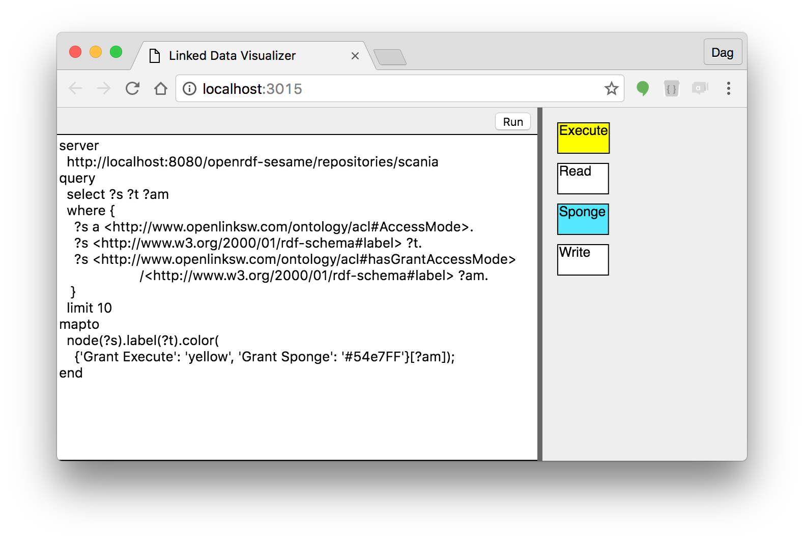
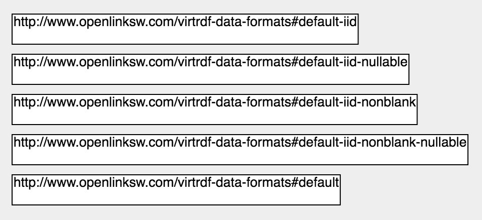

# LDVis - Linked Data Visualizer

<!-- START doctoc generated TOC please keep comment here to allow auto update -->
<!-- DON'T EDIT THIS SECTION, INSTEAD RE-RUN doctoc TO UPDATE -->
<!-- END doctoc generated TOC please keep comment here to allow auto update -->

- [The mapping specification](#the-mapping-specification)
- [Set up development environment](#set-up-development-environment)
  - [Prerequisites](#prerequisites)
  - [Checkout, build and run](#checkout-build-and-run)

<!-- END doctoc generated TOC please keep comment here to allow auto update -->

- [The mapping specification](#the-mapping-specification)
- [Set up development environment](#set-up-development-environment)
  - [Prerequisites](#prerequisites)
  - [Checkout, build and run](#checkout-build-and-run)

<!-- END doctoc generated TOC please keep comment here to allow auto update -->

A web app that visualizes objects and relations in a triple store based on a mapping specification.

The user enters a specification and clicks Run to render a diagram according to the specification.



## The mapping specification

The mapping specification tells

- which server to run the query
- a SPARQL query getting the data to visualize
- which object types to display as graphical nodes of a certain shape
- which relations to display as lines between the nodes
- which relations to display as nodes nested inside each others
- which relations to display as text labels inside the nodes

The app then uses the mapping specification to navigate the triple store and display the nodes and lines.

The initial use case will work with a triple store using Sparql queries according to the SPARQL 1.1 Graph Store HTTP Protocol (see https://www.w3.org/TR/sparql11-http-rdf-update/).
The app may be extended to work for OSLC compliant servers.

### A simple example

```
server
    http://dbpedia.org/sparql
query
    select ?s
    where {
      ?s ?p ?o.
    }
    limit 5
mapto
    node(?s);
end
```
This specification sends a query to the dbpedia database server, that retrieves 5 subjects from it, and creates a diagram node for each of them. It uses the subject URI as key to each node.

The result:



For more information about the specification see [The mapping specification in detail](docs/spec-details.md).

## Set up development environment

### Prerequisites

- access to https://github.com/FindOut/fomod
- node installed - see https://nodejs.org
- git command line (optional)
- google chrome browser - Firefox and IE11+ will be supported later

### Checkout, build and run

```
git clone git@github.com:FindOut/fomod.git
cd fomod
npm install
npm run dev-build
cd ..
git clone git@github.com:FindOut/ldvis.git
cd ldvis
npm install
npm start
```
The last command starts a proxy server and opens a web browser that after five seconds will show the user interface.

If you dont have the git command line installed, you may download the code as a zip from the github web ui.
